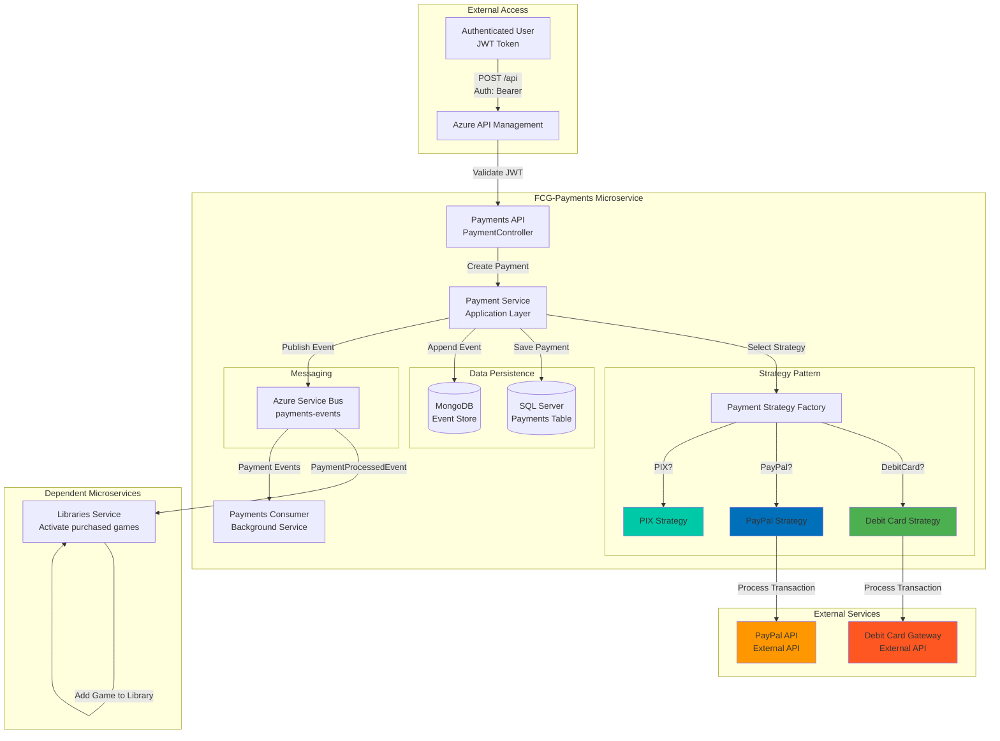
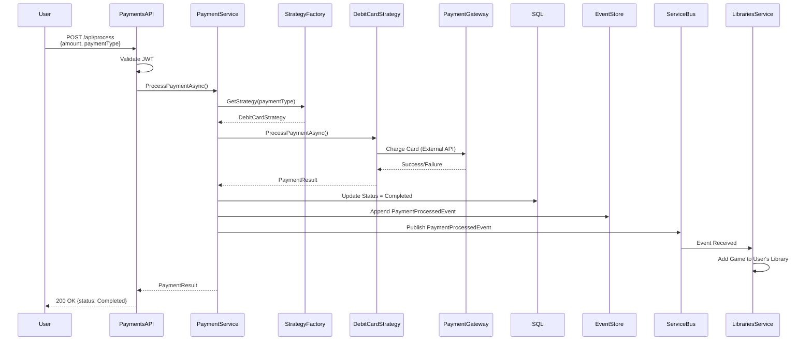

# 💳 FCG-Payments - Payment Processing Service

> **Microsserviço de Pagamentos** - Processamento de transações com Strategy Pattern e Event Sourcing

[](https://dotnet.microsoft.com/)
[](https://blog.cleancoder.com/uncle-bob/2012/08/13/the-clean-architecture.html)
[](https://refactoring.guru/design-patterns/strategy)
[](https://martinfowler.com/eaaDev/EventSourcing.html)
[](https://martinfowler.com/bliki/DomainDrivenDesign.html)

## 🎯 O que é este projeto?

**FCG-Payments** é o **microsserviço de processamento de pagamentos** responsável por orquestrar transações financeiras, integrar múltiplos **gateways de pagamento** usando **Strategy Pattern**, e manter **auditoria completa** através de Event Sourcing. Demonstra integração com sistemas de pagamento externos e gestão de transações distribuídas.

### Responsabilidades Principais
- ✅ Processamento de pagamentos com múltiplos gateways (Cartão de Débito, PayPal, PIX*)
- ✅ Strategy Pattern para algoritmos de pagamento plugáveis
- ✅ Event Sourcing: histórico imutável de todas as transações
- ✅ Publicação de eventos de domínio (PaymentCreated, PaymentProcessed, PaymentFailed)
- ✅ Consumo de eventos de Users/Games para validação de pagamentos
- ✅ Autorização: apenas usuários autenticados podem processar pagamentos

---

## 🚀 Tecnologias e Padrões Aplicados

### Stack Técnico Completo
| Tecnologia | Propósito | Conceito Aplicado |
|------------|-----------|-------------------|
| **ASP.NET Core 8** | Web API Framework | RESTful API, Dependency Injection |
| **Entity Framework Core 8** | ORM | Code-First, Migrations, DbContext |
| **SQL Server** | Banco Relacional | Persistência de transações |
| **MongoDB (Cosmos DB)** | NoSQL Document Store | Event Store (audit trail) |
| **Azure Service Bus** | Message Broker | Topic-based routing, Event distribution |
| **Strategy Pattern** | Behavioral Pattern | Algoritmos de pagamento intercambiáveis |
| **FluentValidation** | Validação | Regras de negócio declarativas |
| **Swagger/Swashbuckle** | API Documentation | OpenAPI 3.0, Interactive testing |
| **Docker** | Containerização | Portabilidade e deployment |

### Padrões de Design Implementados

#### 🎯 **Strategy Pattern (Gang of Four)**
```csharp
// Abstração
public interface IPaymentStrategy
{
    Task<PaymentResult> ProcessPaymentAsync(Payment payment);
}

// Estratégias concretas
public class DebitCardPayment : IPaymentStrategy { }
public class PaypalPayment : IPaymentStrategy { }
public class PixPayment : IPaymentStrategy { }

// Contexto
public class PaymentContext
{
    private readonly IPaymentStrategy _strategy;
    
    public PaymentContext(IPaymentStrategy strategy) 
        => _strategy = strategy;
    
    public Task<PaymentResult> Execute(Payment payment) 
        => _strategy.ProcessPaymentAsync(payment);
}
```

**Vantagens**:
- ✅ Adicionar novos métodos de pagamento sem modificar código existente (Open/Closed Principle)
- ✅ Cada gateway tem sua lógica isolada e testável
- ✅ Seleção dinâmica de estratégia em runtime

#### 🏗️ **Clean Architecture (Onion Architecture)**
```
┌─────────────────────────────────────┐
│   API Layer (PaymentController)     │  ← Apresentação
├─────────────────────────────────────┤
│ Application Layer (PaymentService)  │  ← Casos de Uso
├─────────────────────────────────────┤
│  Domain Layer (Payment Entity)      │  ← Lógica de Negócio
├─────────────────────────────────────┤
│Infrastructure (EF, Strategies, SB)  │  ← Detalhes Técnicos
└─────────────────────────────────────┘
```

#### 📊 **Domain-Driven Design (DDD)**
- **Aggregates**: Payment como aggregate root
- **Value Objects**: Amount (validação de valor monetário), PaymentMethod
- **Domain Events**: PaymentProcessedEvent, PaymentFailedEvent
- **Repositories**: Abstração de persistência
- **Services**: Serviços de domínio para lógica transacional

#### 🔄 **Event Sourcing**
- **Event Store**: MongoDB armazena TODOS os eventos de pagamento
- **Immutable Events**: Histórico completo de criação, processamento, falhas
- **Compliance**: Auditoria para regulamentações financeiras (PCI-DSS, LGPD)
- **Replay**: Reconstruir estado de transações em qualquer momento

#### 📨 **Event-Driven Architecture (EDA)**
- **Domain Events**: Fatos financeiros ocorridos (PaymentProcessed)
- **Integration Events**: Comunicação com outros bounded contexts
- **Eventual Consistency**: Confirmação assíncrona com outros serviços
- **Dead Letter Queue**: Retry automático para falhas temporárias

---

## 📐 Estrutura do Projeto

```
FCG-Payments/
├── FCG-Payments.Api/              # Controllers, Middleware
│   ├── Controllers/
│   │   └── PaymentController.cs   # Endpoints REST
│   └── Program.cs                 # DI Container, JWT Config
│
├── FCG-Payments.Application/      # Casos de Uso, DTOs
│   ├── DTOs/
│   │   ├── CreatePaymentRequest.dto.cs
│   │   └── ProcessPaymentRequest.dto.cs
│   ├── Services/
│   │   └── PaymentService.cs      # Orquestração de pagamentos
│   └── Validators/
│       └── CreatePaymentValidator.cs
│
├── FCG-Payments.Domain/           # Entidades, Enums, Interfaces
│   ├── Entities/
│   │   └── Payment.cs             # Aggregate Root
│   ├── Enums/
│   │   ├── EPaymentStatus.cs      # Pending, Completed, Failed
│   │   └── EPaymentType.cs        # DebitCard, PayPal, PIX
│   ├── Events/
│   │   ├── PaymentCreatedEvent.cs
│   │   └── PaymentProcessedEvent.cs
│   └── Interfaces/
│       ├── IPaymentRepository.cs
│       └── IPaymentStrategy.cs
│
├── FCG-Payments.Infrastructure/   # EF Core, Strategies, Service Bus
│   ├── Data/
│   │   ├── AppDbContext.cs
│   │   └── Migrations/
│   ├── Repositories/
│   │   └── PaymentRepository.cs
│   ├── Strategies/
│   │   ├── DebitCardPayment.cs
│   │   ├── PaypalPayment.cs
│   │   └── PixPayment.cs
│   ├── EventStore/
│   │   └── MongoEventStore.cs
│   └── Messaging/
│       └── ServiceBusPublisher.cs
│
└── FCG-Payments.Consumer/         # Background Service
    └── Workers/
        ├── PaymentsEventsConsumer.cs
        └── LibrariesEventsConsumer.cs
```

---

## ⚙️ Configuração e Execução

### Pré-requisitos
- .NET 8 SDK
- SQL Server (local ou Azure)
- MongoDB (local, Docker ou Cosmos DB)
- Azure Service Bus namespace
- JWT Key (compartilhada com FCG-Users)

### Configuração (appsettings.json)

```json
{
  "ConnectionStrings": {
    "DefaultConnection": "Server=localhost;Database=PaymentsDb;Trusted_Connection=True;"
  },
  "ServiceBus": {
    "ConnectionString": "<service-bus-connection-string>",
    "Topics": {
      "Payments": "payments-events"
    },
    "Subscriptions": {
      "Payments": "payments-subscription"
    }
  },
  "MongoSettings": {
    "ConnectionString": "mongodb://localhost:27017",
    "Database": "EventStoreDb",
    "Collection": "Events"
  },
  "Jwt": {
    "Key": "9y4XJg0aTphzFJw3TvksRvqHXd+Q4VB8f7ZvU08N+9Q=",
    "Issuer": "FGC-Users",
    "Audience": "API"
  },
  "PaymentGateways": {
    "DebitCard": {
      "ApiKey": "<debit-card-gateway-key>",
      "MerchantId": "<merchant-id>"
    },
    "PayPal": {
      "ClientId": "<paypal-client-id>",
      "ClientSecret": "<paypal-secret>"
    }
  }
}
```

### Executar Migrations
```powershell
cd FCG-Payments.Api
dotnet ef database update
```

### Executar API
```powershell
cd FCG-Payments.Api
dotnet run
# API disponível em: https://localhost:7003
```

### Executar Consumer
```powershell
cd FCG-Payments.Consumer
dotnet run
```

---

## 🔐 Endpoints e Autorização

### Matriz de Autorização

| Método | Endpoint | Autorização | Descrição |
|--------|----------|-------------|-----------|
| GET | `/api` | [Authorize] | Listar pagamentos do usuário autenticado |
| GET | `/api/{id}` | [Authorize] | Obter pagamento por ID (apenas do próprio usuário) |
| POST | `/api` | [Authorize] | Criar novo pagamento |
| POST | `/api/{id}/process` | [Authorize] | Processar pagamento pendente |
| DELETE | `/api/{id}` | [Authorize] | Cancelar pagamento (apenas se Pending) |

### Exemplo de Request (Processar Pagamento)

**Obter token JWT**:
```bash
curl -X POST https://localhost:7001/api/auth \
  -H "Content-Type: application/json" \
  -d '{"email": "user@fcg.com", "password": "Senha@123"}'
```

**Criar pagamento**:
```bash
curl -X POST https://localhost:7003/api \
  -H "Authorization: Bearer <token>" \
  -H "Content-Type: application/json" \
  -d '{
    "userId": "3fa85f64-5717-4562-b3fc-2c963f66afa6",
    "gameId": "7b8c9d0e-1f2a-3b4c-5d6e-7f8a9b0c1d2e",
    "amount": 59.99,
    "paymentType": "DebitCard",
    "cardNumber": "4111111111111111",
    "cardHolderName": "John Doe",
    "expiryDate": "12/25",
    "cvv": "123"
  }'
```

**Response**:
```json
{
  "paymentId": "a1b2c3d4-e5f6-7g8h-9i0j-k1l2m3n4o5p6",
  "status": "Pending",
  "amount": 59.99,
  "paymentType": "DebitCard",
  "createdAt": "2026-01-09T10:00:00Z"
}
```

**Processar pagamento**:
```bash
curl -X POST https://localhost:7003/api/{paymentId}/process \
  -H "Authorization: Bearer <token>"
```

**Response (Sucesso)**:
```json
{
  "paymentId": "a1b2c3d4-e5f6-7g8h-9i0j-k1l2m3n4o5p6",
  "status": "Completed",
  "processedAt": "2026-01-09T10:00:30Z",
  "transactionId": "TXN-123456789"
}
```

---

## 🏛️ Arquitetura - Diagrama Mermaid



---

## 🔄 Fluxo de Processamento - Sequence Diagram



---

## 🧪 Padrões de Código Demonstrados

### Strategy Pattern Implementation
```csharp
// Factory para selecionar estratégia
public class PaymentStrategyFactory
{
    private readonly IServiceProvider _serviceProvider;
    
    public IPaymentStrategy GetStrategy(EPaymentType type)
    {
        return type switch
        {
            EPaymentType.DebitCard => _serviceProvider.GetRequiredService<DebitCardPayment>(),
            EPaymentType.PayPal => _serviceProvider.GetRequiredService<PaypalPayment>(),
            EPaymentType.PIX => _serviceProvider.GetRequiredService<PixPayment>(),
            _ => throw new NotSupportedException($"Payment type {type} not supported")
        };
    }
}

// Uso no serviço
public async Task<PaymentResult> ProcessPaymentAsync(Guid paymentId)
{
    var payment = await _repository.GetByIdAsync(paymentId);
    var strategy = _strategyFactory.GetStrategy(payment.PaymentType);
    
    var result = await strategy.ProcessPaymentAsync(payment);
    
    if (result.Success)
    {
        payment.MarkAsCompleted(result.TransactionId);
        await _eventPublisher.PublishAsync(new PaymentProcessedEvent
        {
            PaymentId = payment.Id,
            Amount = payment.Amount,
            ProcessedAt = DateTime.UtcNow
        });
    }
    
    return result;
}
```

---

## 📊 Observabilidade

### Logs Estruturados
```csharp
_logger.LogInformation(
    "Pagamento processado | PaymentId: {PaymentId} | Amount: {Amount} | Type: {Type} | CorrelationId: {CorrelationId}",
    payment.Id,
    payment.Amount,
    payment.PaymentType,
    HttpContext.TraceIdentifier
);
```

### Métricas Críticas
- Taxa de sucesso/falha por gateway
- Latência de processamento por tipo de pagamento
- Volume transacional (diário, semanal)
- Chargebacks e estornos

---

## 🎓 Conceitos Avançados Demonstrados

### **PCI-DSS Compliance**
- Não armazenamos CVV (apenas em memória durante transação)
- Números de cartão tokenizados via gateway
- Logs nunca expõem dados sensíveis

### **Idempotency**
Previne cobranças duplicadas:
```csharp
[HttpPost("{id}/process")]
public async Task<IActionResult> Process(Guid id, [FromHeader] string idempotencyKey)
{
    if (await _cache.ExistsAsync(idempotencyKey))
        return Ok(await _cache.GetAsync<PaymentResult>(idempotencyKey));
    
    var result = await _service.ProcessPaymentAsync(id);
    await _cache.SetAsync(idempotencyKey, result, TimeSpan.FromHours(24));
    
    return Ok(result);
}
```

### **Circuit Breaker Pattern** *(Planejado)*
Proteção contra falhas em gateways externos usando Polly:
```csharp
services.AddHttpClient<IPaymentGateway, DebitCardGateway>()
    .AddTransientHttpErrorPolicy(p => p.CircuitBreakerAsync(5, TimeSpan.FromSeconds(30)));
```

---

## 📚 Referências Técnicas

- [Strategy Pattern (Refactoring Guru)](https://refactoring.guru/design-patterns/strategy)
- [PCI-DSS Compliance](https://www.pcisecuritystandards.org/)
- [Event Sourcing (Martin Fowler)](https://martinfowler.com/eaaDev/EventSourcing.html)
- [Clean Architecture (Uncle Bob)](https://blog.cleancoder.com/uncle-bob/2012/08/13/the-clean-architecture.html)
- [Microservices Patterns (Chris Richardson)](https://microservices.io/patterns/data/event-sourcing.html)
